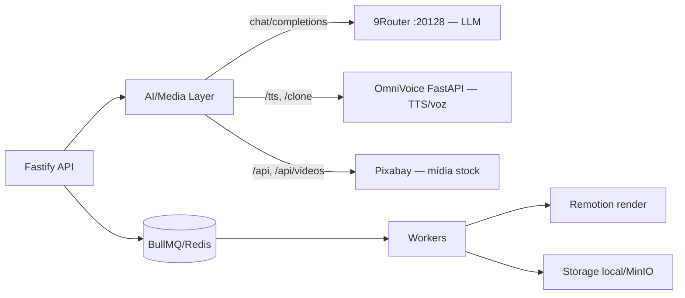

## Objetivo

Construir o **Open Video Studio** do zero: monorepo pnpm com web (Next.js App Router), api (Fastify), editor (Remotion) e packages compartilhados (`config`, `database`), com infra real (Postgres + Redis + MinIO) via Docker e uma camada de IA/mídia composta por **9Router** (LLM), **OmniVoice** (TTS/voz) e **Pixabay** (mídia stock).

## Decisões fechadas

- **Plano completo antes de codar** (este documento).
- **Next.js App Router** + **NextAuth com provider GitHub**.
- **Infra real via Docker desde o início** (Postgres, Redis, MinIO).
- **LLM** → 9Router em Docker, OpenAI-compatible `http://localhost:20128/v1` (modelo padrão `kr/claude-sonnet-4.5`).
- **TTS / clonagem de voz** → OmniVoice Studio (FastAPI local via Docker `palashdeb/omnivoice-studio`). AGPL-3.0 aceito (usado como serviço externo via API).
- **Mídia (imagens + vídeos)** → **Pixabay API** (busca de stock, **não geração**). Cenas recebem mídia via busca por keywords.

## Arquitetura da camada de IA/Mídia (3 providers plugáveis)



| Capacidade | Provider | Interface | Observações-chave |
|-----------|----------|-----------|-------------------|
| **LLM** (roteiro, split em cenas, keywords) | 9Router | `LlmProvider` | cliente OpenAI-compatible |
| **TTS / clonagem de voz** | OmniVoice | `TtsProvider` | upload de amostra → clone; síntese por cena. Contrato HTTP exato confirmado na execução (inspecionar API do OmniVoice) |
| **Busca de mídia (image/video)** | Pixabay | `MediaProvider` | busca por keywords → download p/ storage → `Asset(source=external)` |

### Regras obrigatórias do Pixabay (embutidas no design)
- **API key como secret** em env (`PIXABAY_API_KEY`) — nunca hardcoded no código.
- **Download para o nosso storage** antes de usar (proibido hotlink permanente de imagens). Vídeos podem embedar, mas serão armazenados também.
- **Cache de 24h** das respostas de busca (evita mass-download e respeita o ToS).
- **Atribuição** ("from Pixabay" + autor) exibida quando resultados forem mostrados na UI.
- **Rate limit** 100 req/60s → respeitar via cache + throttle.

## Estrutura do monorepo

```
open-video-studio/
├── package.json · pnpm-workspace.yaml · tsconfig.base.json
├── docker-compose.yml      # postgres, redis, minio, 9router, omnivoice
├── .env.example
├── apps/
│   ├── web/    # Next.js App Router + Tailwind + NextAuth(GitHub)
│   ├── api/    # Fastify + rotas REST + workers BullMQ
│   └── editor/ # Remotion (composição a partir das cenas)
└── packages/
    ├── config/ # env validado (zod) + interfaces Storage/Llm/Tts/Media
    └── database/ # Prisma schema + migrations + seed + client
```

## Fases de implementação

### Fase 0 — Fundação do monorepo
- `pnpm-workspace.yaml`, `package.json` raiz com scripts do PRD (`db:start`, `db:migrate`, `db:seed`, `infra:start`, `dev`).
- `tsconfig.base.json`, ESLint/Prettier, `.gitignore`.
- `.env.example` com: DB, Redis, MinIO/S3, `STORAGE_DRIVER`, `AI_LLM_BASE_URL`/`AI_LLM_MODEL`, `OMNIVOICE_BASE_URL`, `PIXABAY_API_KEY`, `GITHUB_ID`/`GITHUB_SECRET`, `NEXTAUTH_SECRET`, YouTube OAuth.
- `docker-compose.yml`: Postgres, Redis, MinIO, `9router` (porta 20128), `omnivoice` (FastAPI).
- **Verificação:** `docker compose up` sobe os serviços; `pnpm install` resolve workspaces.

### Fase 1 — `packages/config`
- Env validado com **zod** (falha clara se faltar var).
- Interfaces: `StorageDriver`, `LlmProvider`, `TtsProvider`, `MediaProvider`.
- **Verificação:** typecheck + teste do parser de env.

### Fase 2 — `packages/database` (Prisma)
- Schema completo (§5 do PRD) com **enums**: `ProjectStatus`, `SceneStatus`, `AssetKind` (image/video/audio), `AssetSource` (upload/generated/external), `AssetStatus`, `RenderJobStatus`, `YoutubePublishStatus`, `UserRole`, `ApprovalAction`.
- Relações + cascade delete. Migration inicial + `seed.ts` (admin, projeto exemplo, voice profile).
- **Verificação:** `prisma migrate dev` + `prisma generate` + seed.

### Fase 3 — Storage abstrato
- `StorageDriver` (`put/get/getUrl/delete/exists`) com `LocalStorageDriver` e `S3StorageDriver` (MinIO, AWS SDK v3), selecionável por `STORAGE_DRIVER`.
- **Verificação:** integração put→getUrl→get→delete nos dois drivers.

### Fase 4 — Camada de IA/Mídia
- `LlmProvider` (9Router): gerar roteiro, dividir em cenas (JSON estruturado), extrair keywords.
- `MediaProvider` (Pixabay): `searchImages`/`searchVideos` por keywords; download do `largeImageURL`/`videos.medium.url` para o storage; cache 24h; criar `Asset(source=external)`.
- `TtsProvider` (OmniVoice): upload de amostra → clonar voz → sintetizar por cena (retorna path/mime/duration). Confirmar endpoints exatos do OmniVoice na execução.
- **Verificação:** testes unitários com providers mockados (HTTP interceptado); smoke opcional contra serviços reais.

### Fase 5 — API Fastify (núcleo REST)
- Bootstrap: CORS, logger, error handler, validação **zod**, Prisma plugin.
- Rotas (contrato proposto):
  - **Projects:** `GET/POST /projects`, `GET/PATCH/DELETE /projects/:id`
  - **Script/Scenes:** `POST /projects/:id/script/generate`, `POST /projects/:id/scenes/split`, `GET /projects/:id/scenes`, `PATCH /scenes/:id`
  - **Mídia da cena:** `GET /scenes/:id/media/search` (Pixabay), `POST /scenes/:id/media` (escolhe hit → download → vincula asset)
  - **TTS:** `POST /scenes/:id/tts` (OmniVoice)
  - **Voice profiles:** `GET/POST /voice-profiles` (upload de amostra), `PATCH /voice-profiles/:id`
  - **Assets:** `POST /projects/:id/assets` (upload), `GET /projects/:id/assets`
  - **Render:** `POST /projects/:id/render`, `GET /render-jobs/:id`, `POST /render-jobs/:id/retry`
  - **YouTube:** `GET /youtube/oauth/url`, `GET /youtube/oauth/callback`, `POST /projects/:id/publish`
  - **Approval:** `POST /projects/:id/approve`, `POST /projects/:id/reject`, `GET /projects/:id/approval-logs`
- **Verificação:** integração (Vitest + Fastify inject) para CRUD de projeto, geração de roteiro e busca de mídia (IA/Pixabay mockados).

### Fase 6 — Fila BullMQ + Workers
- Filas: `render`, `tts`, `media-fetch` (download Pixabay assíncrono), com payloads tipados.
- Workers atualizam status no Prisma (`queued→running→succeeded/failed`), persistem `errorMessage`, retry.
- **Verificação:** integração enfileira→processa→status (Redis Docker).

### Fase 7 — Editor Remotion (`apps/editor`)
- Composição recebe `{ scenes: [{ mediaPath, mediaKind, audioPath, durationSeconds }] }` e monta timeline (imagem estática ou vídeo + áudio sincronizado por cena).
- Render acionado pelo worker → grava output no storage → atualiza `RenderJob.outputPath`. Padrão 1920×1080 @30fps configurável.
- **Verificação:** render de fixture (2 cenas: 1 imagem + 1 vídeo) gera MP4 válido.

### Fase 8 — Web (Next.js App Router)
- Setup: App Router, Tailwind, **NextAuth (GitHub)**, layout/tema.
- Telas (§6.2): **Dashboard**, **Editor Studio** (roteiro + cenas + busca/seleção de mídia Pixabay + preview), **Biblioteca de Vozes**, **Review** (player + log), **Configurações YouTube**.
- Atribuição Pixabay nos resultados de busca. Cliente de API + polling (tts/media-fetch/render).
- **Verificação:** `next build` ok; smoke E2E dashboard→criar projeto.

### Fase 9 — YouTube + Aprovação
- OAuth2 YouTube (upload), tokens **criptografados**, refresh automático, agendamento, tracking de `youtubePublishStatus`.
- Fluxo de aprovação (`ready_for_review → approved/rejected`) + `ApprovalLog`.
- **Verificação:** integração approve/reject; client YouTube mockado para upload.

### Fase 10 — E2E, CI e DX
- Playwright do fluxo principal (criar → roteiro → cena → buscar mídia → tts → render → review → approve).
- GitHub Actions: lint + typecheck + build + unit + integration + e2e.
- README de setup local (`< 5 min`).
- **Verificação:** pipeline CI verde; cobertura > 80% nas camadas de domínio.

## Rastreabilidade (passo → alvos → verificação)

| Fase | Alvos | Verificação |
|------|-------|-------------|
| 0 | raiz, docker-compose, .env.example | serviços sobem, install ok |
| 1 | packages/config | typecheck + teste env |
| 2 | packages/database | migrate + seed |
| 3 | storage drivers | integração local+MinIO |
| 4 | IA/mídia (9Router/OmniVoice/Pixabay) | unit com mocks |
| 5 | apps/api | integração CRUD + roteiro + busca mídia |
| 6 | filas/workers | job→status |
| 7 | apps/editor | render fixture MP4 |
| 8 | apps/web | build + smoke E2E |
| 9 | YouTube + approval | integração approve/upload mock |
| 10 | E2E + CI | pipeline verde |

## Definition of Done (MVP)

- Fluxo ponta-a-ponta: criar projeto → gerar roteiro (9Router) → dividir em cenas → buscar e baixar mídia (Pixabay, imagem/vídeo) → gerar TTS (OmniVoice) → render (Remotion) → review → approve.
- Infra Docker (Postgres/Redis/MinIO/9Router/OmniVoice) sobe com um comando.
- Regras Pixabay respeitadas (key em secret, download p/ storage, cache 24h, atribuição na UI).
- Login via NextAuth (GitHub). Testes unit + integração + E2E do fluxo principal; CI verde.

## Observações de segurança
- A API key do Pixabay e todos os tokens (GitHub, YouTube) ficam **apenas em variáveis de ambiente**, nunca no código nem no repositório.
- Tokens OAuth do YouTube armazenados criptografados no banco.
